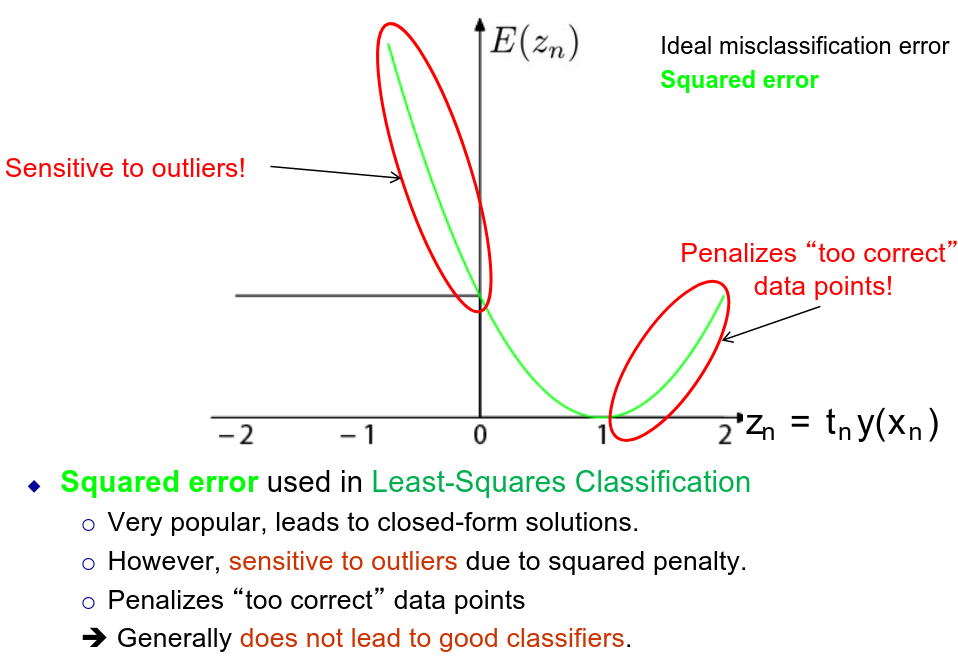

# ML Notes
Rewatch some parts of 7
TODO ALSO REDO lab presentations
## Terms (joni)
* *Datasets*
    * *Train data:* The data you train on
    * *Validation data:* Used to test hyperparameters, train on train data and tune hyperparameters (validation score), afterwards add data to train data and train fully.
    * *Test data:* May never be used to train or tune. Shows how model will perform on unseen data.
* *i.i.d.:* Observations are sampled Independently and Identically Distributed. 
    * *Identically Distributed:* The data we use follows the same underlying joint distribution as the data we will use our model for in "the real world"
        * Train and test data must be identically distributed to each other and to real world data. This not being the case is called **Bias in the dataset**, e.g. a certain group will be favored.
    * *Independently sampled:* There are no subgroups of samples that are correlated (and if there are, we need to take this into account!!)
        * Avoid correlations between samples
* *Curse of Dimensionality:* Too many features -> overfitting.
* *Dimensionality reduction:* number of used features is a hyperparameter.
* *Regularization:* This is a hyperparameter, $C=1/\lambda$. Added on to the back of the loss function $+\frac{\lambda}{2}w^Tw$.
    * Lambda depends on task, number of features and number of samples.
    * Doesn't include $w_0$, don’t penalise getting the average right, even if this means we need a huge $w_0$!
    * Normalise features => effect of regularization ‘similar’ for all features (best to always normalise for any ML model)
    * $L^1$ regularisation: $\lambda||w||_1$ (exclude $w_0$)
        * benefit: can result in sparse solution (many weight = 0)
        * drawback: works really poorly in certain cases
    * $L^2$ regularisation: $\frac{\lambda}{2}w^Tw=\frac{\lambda}{2}||w||^2$ (exclude $w_0$)
* *Margin:* minimal distance to boundary across all training points. Some points determine where the line must be to achieve maximal margin: these will be ON the margin (margin can not be increased without these points being misclassified). These points are called **support vectors**.


* *Classification measures:* 
    * accuracy (TP+TN)/(TP+FP+TN+FN)
    * precision TP/(TP+FP)
    * recall TP/(TP+FN) the probability of detecting a positive
    * specificity TN/(TN+FP) the probability of detecting a negative
    * F1-score 2*precision*recall/(precision+recall)
* *RoC curve:* plots TP on FP
    * *AUC:* area under RoC curve


* Here fits bias/var of model
* *Learning curves vs (cross)-validation curves:*
    * y-axis (same)
        * Both plot (average) training loss and (average) validation loss
        * validation loss always serves as an estimate for loss on unseen data!
        * Both can plot score (‘higher is better’, e.g., accuracy) or loss (‘lower is better’, e.g. MSE)
    * x-axis
        * learning curves: number of samples used for training
        * (cross)-validation curves: any hyperparameter that affects model complexity or training effort
* *Data leakage:* leakage from information from validation or test set to train set.
* *Grouped split:* https://discord.com/channels/@me/1034133139586556034/1057294693718835240 
    * option 1: randomly split all data into 3 sets => identically distributed sets, but leakages (because group A is in train and test set).
    * option 2: (this is grouped split): randomly split entire groups across 3 sets (group A only in train set) => independent sets so no leakage, but sets not identically distributed.
* *Stratified split:* make sure classes are equally represented in train/val/test
* *k-fold cross-validation:* Split training data into k folds: independent and representative for unseen data samples (iid)
    * Idea:
        * train k times, each time using different fold as validation fold
        * Use average of k validation scores to estimate out of sample performance
        * use this estimate to select best hyperparameters
    * Fewer folds: faster training
    * More folds: more robust, slow training
    * Validation errors from different validation strategies are not comparable
    * Note:
        * set up good validation strategy for your problem
        * evaluate this once by checking validate-test gap (should be small)
        * after that: don’t look at test error anymore and never-ever change your validation strategy!
* Gap goes here
* *Confusion matrix:* shows which label was predicted for each class
    * Generalisation of binary classification regions
    * Identify weak spots
    * Show where you may need new features to discriminate between specific classes
    * Maybe cluster and build hierarchy
* *Augmentation:* e.g. rotate, shift, resize, add noise, random feature dropout
    * Advantages
        * Creates more data
        * Model more robust to variability
    * Disadvantages
        * Makes problem more difficult
        * Might need more powerful model
        * New data still similar to old data
    * Diagnose before augmenting, sometimes more data isn't the problem
    * Offline augmentation: create the samples, store, then run model on them
    * Online augmentation: augment each sample on the fly before using it in training.
* *Data cleaning:* e.g. extract region of interest, grayscale, noise cancellation, outlier removal
    * Advantages
        * Makes problem easier
        * Simpler model
        * Need less data
    * Disadvantages
        * Do NOT tune on validation/test data (leakage)
        * Make sure it's robust
* *Outliers:* Different scenarios 
    * Outliers are anomalies that can be easily detected and dealt with
        * Remove them from training data
        * Catch and fix them during inference
    * Outliers can occur but I don’t care what my model does with them
        * Remove them from training data
        * Don't care during inference
    * Some samples may be outliers but I’m not sure which
        * Keep them in train data and try to make model robust against them
    * Outliers can occur and my model must deal with them
        * Keep them and ideally add more through augmentation (this will likely shift your model to have higher bias but be more robust)
* *Dimensionality reduction:* Choose new x and y axis, project the datapoints on these new axis, then remove the axis that contains the least amount of information. This way the data is less correlated (because of the first step) and less complex (due to the second step), and your information loss is minimized.\
This is just one example of dimensionality reduction however. Other techniques exists such as select-K-Best, SelectFromModel (some models, like random forests, return feature importances, so use this to pick the best features), etc.
    * Why reduce dimensionality: simpler models are more robust to overfitting, less computation, fewer parameters (faster inference)
* *Orthogonalisation:* Choose new x and y axis, project the datapoints on these new axis, this way the features are decorrelated. TODO diff between dimensionality reduction
* *Sklearn preprocessing:* 
    * A scaler is applied on the columns, so for every sample feature A with be on the same scale (but not on the same scale as feature B)
    * A normalizer is applied on the rows, so for every sample all their features will be normalised independent of other samples.
    * A transformer also operates feature-wise (so on the columns)
* *Model calibration:* This means giving a probability to a certain classification, for example this is a dog with probability 0.4 🐕
    * Usually powerful models are overconfident, due to a lack of data/overfitting. This way, smaller classes give poor calibration results.


* *Reject:* A reject option is used to reject samples the model can't classify (like a picture of a face for a leaf detection app). We need calibration for this since this happens post classification. If the probability is too low we reject.
* *Explainability:* being able to explain the results your model gave you
    * Permutation importance: permute one of the feature values and see how to result changes. This method is model agnostic and simple to implement. However it is very brute force and can give misleading results for correlated features. Also results are global not on a per sample basis.
    * Partial dependence plots: Sweep 1 feature while keeping the rest, make a plot to show impact, can extend to 2D plots to combine 2 features.
* *Fairness:* Absence of any prejudice or favoritism toward an individual or group based on their inherent or acquired characteristics
    * Hard to achieve fairness, since you don't have infinite data and the real world also isn't fair.
 
### Bias and Variance of model
* *Bias of a ML model:* the expected value across training sets of the expected value of the error of a model $E(g(x',\theta),f(x'))$ on unseen data $x'$
    * $\mathbb{E}_{T_N}[\mathbb{E}_{(x',r')}[E(g(x',\theta),f(x'))]]$, note: $T_N$ means across training sets and $(x',r')$ means across unseen data
    * due to noise we can't estimate $f(x')$ so we replace this $\mathbb{E}_{T_N}[\mathbb{E}_{(x',r')}[E(g(x',\theta),r']]$
        * labels in validate and test set may contain noise
        * we only have a finite validate and test set
* *Variance of a ML model:* $Var[\mathbb{E}_{(x',r')}[E(g(x',\theta),f(x'))]]$
* As we increase complexity of the model: bias decreases (better fit to truth) and variance increases (fit varies more with data)


**Recap of both**
* Bias
    * Expectation across models that are trained with different subsets of data of the expected model error on unseen data compared to the ground truth
    * "capability" of chosen estimator to approximate the ground truth
    * This is a theoretical concept: you can not measure it
    * High observed error:
        * High bias: model is too simple (make model more complex)
        * Large irreducible error: features do not contain the necessary information (get better features)
* Variance
    * Variance across models that are trained with different subsets of data of the expected model error on unseen data compared to the ground truth
    * "sensitivity" of estimator training procedure to variability in the train data
    * This is a theoretical concept: you can not measure it
    * High variance
        * Model is overfitting: data set used for training affects final model a lot
        * Make model simpler, get more data or live with it


### GAPs
#### Train-validate gap
* Overfittting
    * Model not properly regularised
    * Too many features
    * Model too complex for given data set
* Train and validate splits not identically distributed
* Validation set too small
* Split analysis
    * Split not identically distributed
        * did you use stratified split
        * too many folds
        * Grouped split
    * Unknown subgroups (latent variables)
#### Validate-test gap
* Leakage
    * Validation split not independent
    * Leakage in preprocessing pipeline: everything that is computed from data must be refitted for each fold
* Overfitting on validation set
* Split between train/val and test not identically distributed

## Model explanations
### KNN
An object is classified by a plurality vote of its neighbors, with the object being assigned to the class most common among its k nearest neighbors (k is a positive integer, typically small).
If k = 1, then the object is simply assigned to the class of that single nearest neighbor.

* Non-parametric (nothing to tune except the hyperparameter)
* Hyperparameter is k
* Bad predictions at the edges of the dataset

### Linear discriminants/classification
$g(x|\theta)=\sum_{j=1}^d w_j x_j + w_0$

$(w_0,w_1,...,w_d)=\theta$

Regression Log likelihood: $L(\mathbf{\theta}|X,r) = \sum_{t=1}^N[r_t-g(\mathbf{x_t}|\mathbf{\theta})]^2$

Classification Log likelihood(logistic regression): $L(\mathbf{\theta}|\mathbf{X,r}) = - \sum_{t=1}^N \sum_{i=1}^K r_i^t log(P[C_i|\mathbf{x,\theta_i}])$

$P[C_i|\mathbf{x,\theta_i}] = \frac{exp(g_i(x|\theta_i))}{\sum_{t=1}^N exp(\mathbf{x_t}|\mathbf{\theta})}$
* Training has scaling behaviour
* Simple inference for new data: O(d) memory and computation

For classification add a sigmoid function at the end

### SVM (Support Vector Machines), end of slides 2
Maximise the margin

Minimise the Lagrangian:
$$ L_p = \frac{1}{2}||w||^2 - \sum_{t=1}^N\alpha_t r_t(w^T_t x_t+ w_0)+\sum_{t=1}^N\alpha_t$$
* Computational complexity ~ $O(N^3)$
* Sparse solution
* A solution only exists IFF the data is linearly separable.
* At inference time, only product between new data point and the support vectors.
#### Soft margin SVMs
Allow for some points within the margin and thus for some misclassification (we do this to avoid overfitting). Support vectors are all points on or in margin. We add a regularisation parameter C.
* Large C = more penalty, closer to hard margin
* Small C = less penalty, more errors allowed, more regularisation
Used loss function: Hinge loss (blue line)
* Robust to misclassified outliers
* No penalisation of too correctly classified samples
* Still favours sparse solutions
* Only piecewise differentiable


### PCA (Principle Component Analysis)
Projects datapoints to a new space, (new x and y axis), then the projected features are orthogonal/decorrelated. PCA is very sensitive to scaling: small but relevant features may be suppressed.\
PCA also improves explainability of the model: correlated features are often exchangeable, decorrelated features are not.\
PCA identifies dimensions with low variance, if all samples are very similar in a given linear subspace, this may be an indication that this subspace is less useful. But: PCA is unsupervised(!!) so be careful with conclusions here PCA feature importance (eigenvalue) not necessarily related to task importance.

### LDA (Linear Discriminate Analysis)


LDA finds projection in 1 dimension for which separation between classes is maximised, orthogonal to decision surface = parallel to $w$. LDA is supervised (it takes labels into account).

**PCA vs LDA**


### Kernels
A kernel $K(x,x')$ is an inner product between two vectors in some vector space in which the vectors $\phi(x)$ are transformed versions of $x$. A kernel is always a symmetric function of two d-dimensional vectors. So by definition, a positive definite kernel function is a valid kernel, also: all kernels are symmetrical!
$$y(x') = \sum^N_{t=1}\alpha_t r_t (\phi(x_t)^T\phi(x'))+w_0=\sum^N_{t=1}\alpha_t r_t K(x_t,x')+w_0$$
By rewriting a linear model in inner product form, it no longer depends on $\phi(x')$, but only on the kernels. If we know the kernel, we don’t need to know the feature space explicitly, we only need to know it exists!

New kernels can be formed by combining existing valid kernels.\
**Why kernels:**
- Storing $\phi(x_1),...,\phi(x_N)$ requires O(NM) memory
- Storing $K(x_1,x_1),...,K(x_N,x_N)$ requires O(N^2) memory
- They are also faster
- We can work with higher dimensional feature spaces since we don't need $\phi(x)$ anymore.
- They are more flexible than $\phi$
- Kernels can be used to introduce non-linearity whenever a model only depends on the data through the inner products between the new feature vector and the training feature vectors.

**Drawbacks**
- kernels depends on new data point and training data points
- in need to store all training data
- and compute kernels at inference time

#### Polynomial kernel
The kernel is a polynomial of degree $q$: $K(x_t,x)=(x^Tx_t+1)^q$\
For large q: computing kernel function is MUCH less costly than computing the transformation and the inner product!

#### Gaussian kernel
$K(x,x')=exp(-||x-x'||^2/2\sigma^2)$\
This kernel is also an inner product: separate x-es from x’-es: through Taylor series development.\
Infinite series -> infinite dimensional kernel!\
Gaussian kernel replaces projection of data into an infinite dimensional space. Inner product would not even be computable!\
Kernel width $\sigma$ acts as a regulariser:
Small $\sigma$: kernel function drops off more quickly, thus fewer training points have significant impact on model output for $x$. Larger $\sigma$ = lower variance, higher bias.

#### Kernel SVM
**Kernel SVMs combine the power of SVMs:**
- Discriminant-based: No need to estimate densities first
- Sparse model: Define the discriminant in terms of support vectors
- Convex optimization problems with a unique solution (but scales badly with N!!)

**With the power of kernels:**
- The kernel trick to obtain non-linear models without explicit feature transformation
- Application-specific measures of similarity

**Drawbacks**
- learning scales badly with dataset size (quadratic programming)!! (but lots of effort has gone into improved QP techniques)
l they still need good features and a good choice of kernel (which is why neural networks have taken a lead)

**K-NN vs kernel reg/class vs kernel SVM**


### MLP (Multi-Layer Perceptrons)
Standard stuff input layer, hidden layers, output layer
#### Back-propagation
IDK if we need to know this

### Deep neural networks
They have lots of parameters so easily overfit, we need to regularize. We can do this by applying L2 or L1, early stopping (stop training when validation error starts to rise), data augmentation, adding noise, dropout,.

## QnA (tom)
### Chapter 4
#### What are latent variables
> **Discuss latent variables in continuous and discrete case + pros/cons of them**

Variables which are always unobserved are called latent variables. Latent variables may appear naturally, from the structure of the problem or can be introduced intentionally to model complex dependencies between variables.\
**Discrete:** Clustering\
**Continuous:** Dimensionality reduction (= linear or nonlinear regression with *missing* inputs)\
**Pros:**
- Statistically powerful
- Many use cases:
    - Learning with missing data
    - Clustering
    - PCA
    - Recommender Systems

**Cons:**
- It's a black box => not very explainable
- Hard to statistically guarantee convergence to a correct model with more data
- Harder computationally
    - But the Expectation-Maximization algorithm helps with this

> **How to deal with latent variables**

We will use Expectation-Maximization to help solve problems with latent variables

#### K-Means
> **Explain the K-Means algorithm**

1. Init K centroids (centers)
2. (E) Given centers, assign points to nearest cluster
3. (M) Given points, update centers to be the new cluster means
4. Repeat from step 2

> **Is (global) convergence guaranteed?**

To a local minima yes, but not a global minima. This also depends on the Init step.

> **What is vector quantization?**

Image compression is vector quantization, picking an amount colors as K, for compression. K-means then picks the most used colors.

> **How to select optimal K?**

Depends on: application, data (plot and look), etc

> **What is the complexity of K-Means**

(E) Compute distance of N objects for K centers: O(K.N)\
(M) Compute centers (each object added to cluster): O(N)\
Total m iterations: O(m.K.N)

> **K-Means pros and cons?**

**Pros:**
- Simple and fast to compute
- Guaranteed local minima

**Cons:**
- Hard to choose K
- No soft assignment, so a points on the edge of a cluster can easily swap with a small shift of data
- Sensitive to initial centers
- Sensitive to outliers (1 outlier can pull and entire center due to average)
- Can only detect spherical clusters

> **Difference between K-Means and K-NN**

KNN is a supervised learning algorithm, whereas K-Means is an unsupervised learning algorithm.

#### Mixture of Gaussians (MoG) = Gaussians Mixture Models (GMM)
MoG: sum of M normal distributions, mixing density = sum of Gaussian mixture component times mixing coefficient


> **Difference between K-Means and MoG**

K-Means uses circular boundaries while MoG can have elliptical boundaries. Another thing is that GMs is a probabilistic algorithm. By assigning the probabilities to datapoints, we can express how strong is our belief that a given datapoint belongs to a specific cluster.

> **Discuss MoG: properties and problems**

- Can have elliptical boundaries
- Is probabilistic instead of hard assignment

TODO Problems?

> **Draw & explain a MoG generative model as a directed graphical model. Explain all variables**


(Keep in mind middle bottom circle is observed/shaded)
We have N observations (see plate notation), the latent variable j is a discrete random variable that define to which Gaussian you below (e.g. Gaussian 1, see image above), $x_n$ are the datapoints that the Gaussians generate. The fixed variables are: $\pi$ the probability to which Gaussian you belong, $\mu$ and $\Lambda = 1/\Sigma$ characterize the Gaussian.

> **Does a MoG model has discrete and/or continuous latent variables?**

It has $j_n$ as a latent variable, which is a discrete latent variable.

> **Model selection problem: How to select the optimal number of mixture components (K) for a MoG model**

TODO, probably also just depends on data

> **Is a closed form analytical Maximum Likelihood estimation possible for a MoG model**

No, since there is responsibility of a component $\gamma_j$ depends on $\mu_j$ of every Gaussian and $\mu_j$ depends on the responsibility, this means everything is coupled. The optimization of 1 Gaussian depends on all the other Gaussians! So there is no closed form solution.


#### Expectation-Maximization for MoG


> **Discuss EM for MoG: include "Credit Assignment Problem" & the "Mixture Density Estimation"**

**EM:**
1. (Credit Assignment Problem) Expectation step, given Gaussian mixtures => get latent variable $j$, using Bayes decision rule. Label data based on Gaussians.

2. (Mixture Density Estimation) Maximization step, given latent variable $j$ => get Gaussian mixtures, using MLE. Remake Gaussians based on labeled data.
3. Check for convergence

> **Is regularisation needed in EM?**

We need to avoid singularities in the estimation, Mixture components may collapse on single data points. If this happens this datapoint will cause $\sigma_j$ to go to 0 and therefore make the likelihood function go to infinity

To solve this problem we need regularisation, we enforce a minimum width for the Gaussians.

> **Give technical advice**

- EM is very sensitive to the initialisation
    - convergence is a local minima
    - and slow
- if we init with K-Means we get better results!!!
    - First run K-Means (fast) and use those results as start for the EM

### Chapter 6
#### Graphical models
> **Describe the key properties of graphical models. Why useful?**

Graphical models are graphical representation of probability distribution, they are the marriage between probability theory and graph theory (visualize the structure of a probabilistic model through a graph, then find efficient solutions using graph theory).\
They are a natural tool for dealing with uncertainty and complexity.

#### Directed graphical models
> **What is "Causal inference"? What is "Diagnostic inference"?**

Causal inference: If the sprinkler is on, what is the probability that the grass is wet? So: given cause, what is diagnostic
Diagnose inference: Knowing that the grass is wet, what is the probability that rain is the cause? So: given diagnostic, what is cause

> **How to get a factorized representation of the joint distribution in directed graphical models?**

You can see this in the graph's structure, in formula:
$$p(x)=\prod_{k=1}^K p(x_k|pa_k)$$
with $pa_k$ the parents of node $x_k$

> **Discuss “conditional independence” in directed graphical models. Discuss Divergent, Chain & Convergent cases.**

Condition independence means $P(a|b,c)=P(a|b)$, a is independent of c given b.\
**Divergent**
```
   c [ ]           c [x]
    /   \           /   \
   v     v         v     v
a [ ]   [ ] b   a [ ]   [ ] b
   case 1           case 2 
```
In case 1 a and b are NOT independent\
In case 2 a and b are conditionally independent\
**Chain**
```
a    c    b       a    c    b
[ ]->[ ]->[ ]     [ ]->[x]->[ ]
    case 1            case 2
```
In case 1 a and b are NOT independent\
In case 2 a and b are conditionally independent\
**Convergent**
```
a      b    a      b
[ ]   [ ]   [ ]   [ ]
  \   /       \   /
   v v         v v
   [x] c       [ ] c
  case 1      case 2
```
In case 1 a and b are NOT independent\
In case 2 a and b are conditionally independent\

> **What is explaining away?**

The phenomenon of explaining away means that observations of the child nodes will not block paths to the co-parents.


The sprinkler is explained away by new evidence.

> **What is a Markov blanket for directed graphical models?**

The minimal set of nodes that isolates $x_i$ from the rest of the graph. This includes:
- Parents
- Children
- Co-parents of $x_i$


#### Undirected graphical models
> **What is a Markov blanket for undirected graphical models?**

This is just all the neighbours.

> **How to factorize an undirected graph? What is a (max) clique? Why normalization constant needed?**

A clique is a fully connected subset of nodes, the max clique is the largest clique in the graph.\
The joint distribution is written as product of (non-negative) potential functions $\psi_C(x_C)$ over maximal cliques in the graph:
$$p(x) = \frac{1}{Z} \prod_C\psi_C(x_C)$$
The normalization constant Z is called the partition function:
$$Z=\sum_x\prod_C\psi_C(x_C)$$
Bayesian networks are automatically normalized. Markov Random Fields are not. This normalization constant is a major limitation computation wise.

> **Compare Directed vs Undirected graphs.**

**Directed Graphs**
- Better at expressing causal relationships.
- Interpretation of a link: Condition probability $P(b|a)$
- Factorization is simple
- Conditional independence is more difficult

**Undirected Graphs**
- Better at representing soft constraints between variables
- Interpretation of a link: There is some relation between a and b
- Factorization is complicated
- Conditional independence is simple

> **How to convert directed to undirected?**

If it's a chain just replace the directional links with regular links.\
Else, when there are multiple parents, we need to introduce additional links, we need to marry the parents: fully interconnect them, this process is called **moralization**, It results in the **moral graph**.


#### Inference in graphical models
> **What is inference in graphical models**

Definition: Evaluate the probability distribution over some set of variables, given the values of another set of variables (= observations).
<!--  -->


**Also understand this**


### Chapter 7


#### Bayesian approach
> **How can we prevent overfitting systematically**

We add regularization, so we penalize large coefficient values. We add a quadratic regularizer, this is called L2-regularization or ridge regression.

> **How can we avoid the need for validation on separate test data**

We express our uncertainty with Bayesian curve fitting, so we know how our model will perform.

#### Maximum Likelihood
> **Does Maximum Likelihood (ML) estimation for the parameters of a Gaussian distribution under- or overestimate the true mean and/or variance? Explain + give math expression**

We have a biased variance, so we need to multiply with a correction factor: $\sigma^2=\frac{N}{N-1}\sigma_{ML}^2$. If N (the amount of samples) goes to infinity there is no problem. It underestimates the variance of the distribution, ML overfits to the observed data.

> **What happens is nr_or_data_samples == 1**

The likelihood with collapse on that one point.


#### Linear regression: Least-Squares regression == MLE
> **Prove & explain that Least-Squares regression is equivalent to Maximum Likelihood (ML) estimation under the assumption of Gaussian output noise. Derive and formulate the ML solution $w_{ML}$**


#### Linear regression: L2-regularized linear regression == MAP
> **Linear regression: Prove & explain that L2-regularized linear regression (ridge regression) is equivalent to Maximum-A-Posteriori (MAP) estimation under the assumption of Gaussian output noise & with a Gaussian prior on the coefficients w**\
> Derive and formulate the MAP solution $w_{MAP}$
> - assume that the output noise is Gaussian distributed (1/$\beta$ = noise variance),
> - introduce a prior Gaussian distribution over the coefficients (1/$\alpha$ = variance),
> - express the posterior distribution over w,
> - & calculate the MAP solution $w_{MAP}$.


> **Is the MAP solution $w_{MAP}$ a fixed value or a distribution?**

Fixed value since it's the maximum of the posterior

#### Bayesian learning
> **Draw & explain a generative model (as a directed graphical model)**\
> in the supervised case, and give the predictive probability p( t’ | x’ , x , t ) for a new output t’, given a new input value x’, and conditioned on the observed (training) data x , t

$$p(t'|x',x,t)=\int p(t'|x',w) p(w|x,t)dw$$
* $p(w|x,t)$: posterior distribution over w
* $p(t'|x',w)$: predictive distribution over t given w


> in the unsupervised case, and give the predictive probability p( x’ | x ) for a new data sample x’, conditioned on the observed (training) data x

$$p(x'|X)=\int\frac{p(x'|\theta)p(X|\theta)p(\theta)}{\int p(X|\theta)p(\theta)d\theta}d\theta$$
* $p(x'|\theta)$: estimate for x based on parametric form $\theta$
* $p(X|\theta)$: likelihood of the parametric form $\theta$ given the data set X
* $p(\theta)$: prior for the parameters $\theta$
* under frac: normalization


#### Bayesian curve fitting
> **Draw and explain the bayesian curve fitting generative model as a directed graphical model.**
> - Focus on understanding the graphical model representation for learning and prediction
> - What are the key differences between ML estimation and Bayesian learning approach to estimate model weights vector


### Chapter 8
#### HMM
> **Describe an HMM**


We don't know which state the model is in we only know the observed variables and the state transition probabilities, with this information we can estimate the probabilities of being in each state. Also in an HMM $z_i$ only depends on $z_{i-1}$, and of course observations only depend on the current state.

#### Explain differences
> **Generative vs Discriminative models**

Discriminative models are supervised learning models and will classify the data into classes. Generative models are used to generate new datapoints, and want to model the actual data distribution instead of just defining a decision boundary.

> **Parametric vs Non-parametric models**

**Parametric**
- Fixed number of parameters
- small number of parameters with often physical interpretations
- computationally fast
- stronger assumptions about the data (may perform bad when assumptions are wrong)

**Non-parametric**
- flexible number of parameters
- this number grows with more data
- no (or little) a priori knowledge about the form of the true function.
- computationally slower
- few assumptions about the data

#### SE (Squared Exponential)
> **What are the hyperparameters of the SE kernel?**

Signal variance, length scale and noise variance

> **How can we estimate these hyperparameters?**

These hyperparameters are interpretable and can be learnt from the data.

> **Do we use cross-validation to estimate the hyperparameters**

No we just learn them from the data.

#### GPs
> **Give the definition of a GP**

A Gaussian Process (GP) is a collection of random variables, any finite number of which have a joint Gaussian distribution. A GP is a Gaussian distribution over functions.

> **What is needed to specify a GP?**

To specify a GP we need: a mean function and a covariance function (kernel function)

> **Give the predictive distribution $p(y^*|x^*,X, y)$ of a GP (in the noise-less case). List and describe all parameters or variables.**

$p(y^*|x^*,X, y) = N(y_*|\mu_*,\Sigma_*)$\
With mean and covariance given by\
$\mu_*=k_*^T K^{-1}y$\
$\Sigma_*=k(x_*,x_*)-k_*^T K^{-1}k_*$\
* $y^*$ is wanted output of new points
* $x^*$ is the new point
* $X$ are training points 
* $y$ are outputs of training points
* $k^*$ is the vector of $k(x_n,x^*)$ for n in 1-N

We use the conditional distribution property of joint Gaussians, namely the new mean is the previous mean and a correction factor, idem for the covariance. Since the mean was 0 we just have the correction factor for the mean. For the covariance we keep the original covariance (which is the kernel function) minus the Schur complement.

> **Give the predictive distribution $p(y^*|x^*,X, y)$ of a GP (in the noisy case). List and describe all parameters or variables**

$p(y^*|x^*,X, y) = N(y_*|\hat{\mu}_*,\hat{\Sigma}_*)$\
With mean and covariance given by\
$\hat{\mu}_* = k_*^T (K+\sigma_n^2I)^{-1}y$\
$\Sigma_*=k(x_*,x_*)-k_*^T (K+\sigma_n^2I)^{-1}k_*$\

* $y^*$ is wanted output of new points
* $x^*$ is the new point
* $X$ are training points 
* $y$ are outputs of training points
* $k^*$ is the vector of $k(x_n,x^*)$ for n in 1-N
* $\sigma_n$ is the noise parameter

We use the conditional distribution property of joint Gaussians, namely the new mean is the previous mean and a correction factor, idem for the covariance. Since the mean was 0 we just have the correction factor for the mean. For the covariance we keep the original covariance (which is the kernel function) minus the Schur complement.

> **Discuss the computational complexity of a GP (i.e., the computational complexity of the training, the calculation of the prediction mean, and the prediction variance).**

Training is cubic in the number of training points $N$\
Prediction mean is linear in $N$ (note:$K^-1y$ is calculated upfront)\
Prediction variance is quadratic in $N$\
This gives a practical limit of $N=10 000$

> **Describe the key properties (pros/cons) of a GP**

Gaussian processes are Normal distributions over functions, specified by a mean and covariance function.\
Gaussian processes are probabilistic and non-parametric, they produce well-calibrated uncertainty estimates.\
GP's hyperparameters are interpretable and can be learnt from the data, no expensive cross-validation required.\
But they are difficult for a large input data set (matrix inversion O(N^3)).

#### BO (Bayesian Optimization)
> **Draw and discuss the flow-chart of Bayesian Optimization (BO) (no math required, flowchart)**


We build a model with base data, then we add data based on where the loss function think this would help the model. Then we repeat this process.

> **What is surrogate-based optimization (SBO)?**

This is the engineering approach, and is used for computationally expensive design optimization.

> **What is an infill criterion, a sampling policy?**

The loss function used in BO.

> **What is an acquisition function?**

The loss function used in BO.

> **How do we name the loss function of GP-based optimization, or Bayesian Optimization (BO), in the engineering community, and in the machine learning community?**

ML: Acquisition function
ENG: infill criterion, sampling policy

### Chapter 9
#### Coming multiple learners
> **Explain: ensembles, key properties, strengths and weaknesses**

An ensemble is a combination of multiple (weaker) classifier models, it is important that their errors are as uncorrelated as possible. Then using a majority vote better results will be achieved. They are easy to implement and not too much parameter tuning is required.

However there are some drawbacks, the learning time will be longer and will require more memory. It is also not very explainable.

A major weakness is that usual the errors of the models are correlated and so not much improvement is gained.

> **Explain stacking**

Stacking uses L first level classifiers the input then gets fed to all these classifiers, their output then gets passed as a feature vector to a meta classifier that then outputs the actual result.

> **Explain bagging**


Bagging stands for bootstrap aggregation, this mean the individual classifiers will be trained on different data sets using bootstrapping. We take K samples from the N total (with replacement) and train the first classifier with that, repeat this for each classifier.\
The committee predictor is just a majority vote.

> **Explain boosting**


The idea of boosting is that we fit models one at a time and re-sample the mistakes of the previous model and add them to the next model's training set.\ 
Finally we also use a majority voting system.

> **Explain AdaBoost**

AdaBoost stands for adaptive boosting. Just like boosting we also fit models one at a time, and used the previous model's misclassified samples. But this time instead of re-sampling we re-weight these misclassified samples so that they have a bigger impact.\
AdaBoost manages to achieve better results in general than regular boosting. It is also robust against overfitting and works with many different types of classifiers.\
A disadvantage of AdaBoost is that is requires high-quality data to perform well (sensitive to outliers). It's just like boosting slow since it can only fit 1 model at a time.

> **Explain AdaBoost for feature selection**

AdaBoost can be used as a feature selector by training a classifier for each feature.

> **Explain loss functions**




> **Explain keys steps in Viola-Jones face detector**

It uses AdaBoost to select the informative features and to form the classifier. We want to select the best rectangle feature and threshold, so each round we re-weight the examples according to errors, then choose another filter/threshold combo.\
It also uses attentional cascade, a negative response from any of the classifiers leads to instant rejection, so we start with simple classifiers that rejects many of the negative sub-windows and accepts (almost) all of the positive sub-windows. Then we move to a more complex classifier and so on.

#### Decision Trees
> **Explain CART**

The goal of the CART (Classification And Regression Trees) framework is to make a tree that is a simple/small as possible. Its key steps are:
- Start at the root node
- Progressively split the training data into smaller and smaller subset
- In each step, pick the best attribute to split on, continue until subsets are all pure (have 1 label)

> **Explain Occam's razor**

If you have more than one possible explanation for a phenomenon, you should always choose the simplest one.

> **Explain Entropy Impurity**

Entropy is a formula from information theory, its goal is to minimize the expected number of bits to encode all classes, therefore if we have a lower entropy, we gain information. Thus we want to minimize this entropy by picking the best splitting features.

> **Explain properties and limitations of Decision Trees**

**Properties:**
- Simple learning procedure, fast inference
- Can be applied to metric, nominal or mixed data
- Easy to visualize
- Explainable

**Limitations:**
- Often noisy or weak classifiers
- Don't generalize well
- Data fragmentation: As the tree progresses splits are selected on less and less data
- overfitting and underfitting for resp. deep and shallow trees.
- Expensive learning step, due to costly selection of optimal split
- Sensitive to small shifts in datapoints

#### Random Forests
> **Describe key features**

Create an ensemble of many simple decision trees. The trees are unpruned (fully grown). And inject some randomness into the trees such that: each tree has maximal strength (so a good model on its own) and minimum correlation with the other trees.

> **Cross-validation used?**

No, there is no need for cross-validation since we use bagging, so on average we will have 37% remaining samples, called OOB (Out Of Bag) samples, to use for validation.

> **Explain properties and limitations of Random Forests**

**Properties:**
- Good accuracy
- Simple
- robust to overfitting
- Can handle unbalanced data
- Gives estimates of variables importance in classification
- Parallelized
- Faster training than boosting

**Limitations**
- Feature selection process is not explicit
- Feature fusion is less obvious
- Requires a lot of memory
- Need large amounts of training data
